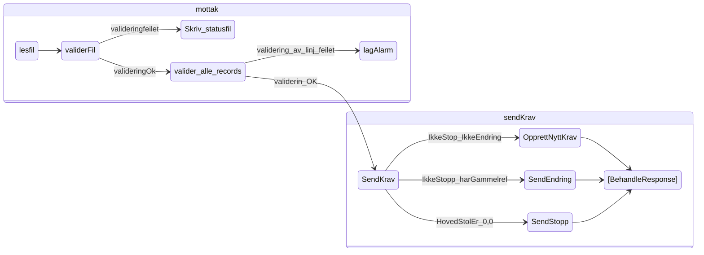
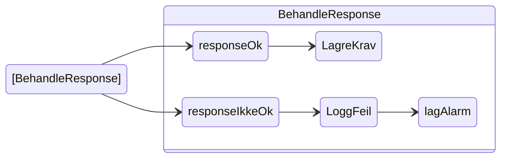

# sokos-ske-krav

* [1. Funksjonelle krav](#1-funksjonelle-krav)
* [2. Utviklingsmiljø](#2-utviklingsmiljø)
* [3. Programvarearkitektur](#3-programvarearkitektur)
* [4. Deployment](#4-deployment)
* [5. Autentisering](#5-Autentisering)
* [6. Drift og støtte](#6-drift-og-støtte)
* [7. Henvendelser](#7-henvendelser)

# 1. Funksjonelle Krav

Applikasjonen er en tjeneste som sender tilbakekrevingskrav til Skatteetatens nye REST tjeneste, som på sikt skal
ertstatte PAK.  
Den henter flatfiler fra filmottakserveren, mapper de om til objekter, og sender kravene
ihht [SKE sin kontrakt](https://app.swaggerhub.com/apis/skatteetaten/oppdragsinnkreving-api/).
SKE sender tilbake en *kravidentifikator* som kobles til NAV sitt saksnummer for kravet og blir så lagret i database.
Oppbygninen av flatfilene er dokumentert
i [confluence](https://confluence.adeo.no/pages/viewpage.action?pageId=176706565)

# 2. Utviklingsmiljø

### Forutsetninger

* Java 25
* Gradle
* [Kotest](https://plugins.jetbrains.com/plugin/14080-kotest) plugin for å kjøre Kotest tester
* [vault](https://github.com/navikt/utvikling/blob/main/docs/teknisk/Vault.md) for å kjøre `setupLocalEnvironment.sh`
* [jq](https://github.com/stedolan/jq) for å kjøre `setupLocalEnvironment.sh`

### Lokal utvikling

NB! Du må ha [naisdevice](https://docs.nais.io/device/) kjørende på maskinen.

For å kjøre applikasjonen må du gjøre følgende:

- Kjør scriptet [setupLocalEnvironment.sh](setupLocalEnvironment.sh)
     ```
     chmod 755 setupLocalEnvironment.sh && ./setupLocalEnvironment.sh
     ```                                
  Denne vil opprette [default.properties](defaults.properties) med alle environment variabler (bortsett fra
  POSTGRES_USERNAME og POSTGRES_PASSWORD, som må hentes manuelt fra vault) du trenger for å kjøre
  applikasjonen som er definert i [PropertiesConfig](src/main/kotlin/sokos/ske/krav/config/PropertiesConfig.kt).

### SFTP tilkobling

Etter at ```setupLocalEnvironment.sh``` er kjørt, vil den opprette en ```privKey``` fil. Den burde legges inn der man oppbevarer ssh nøkler, f.eks ```.ssh```.
Scriptet vil hente brukernavn og passord til ```defaults.properties``` i form av variablene ```SKE_SFTP_USERNAME``` og ```SKE_SFTP_PASSWORD```.

FileZilla er en god klient for å koble seg til SFTP. Bruk login with key file.
Host og port finner man i [PropertiesConfig](https://github.com/navikt/sokos-ske-krav/blob/main/src/main/kotlin/no/nav/sokos/ske/krav/config/PropertiesConfig.kt#L45-L46)

På MacOS kan den be om en ```.ppk``` nøkkel. Isåfall la FileZilla automatisk konvertere privatnøkkelen til .ppk og referer til denne.

For å teste manuelt i dev når man er logget på, legger man en testfil i ``ìnbound`` mappen. Kjøring kan trigges med endepunktet [https://sokos-ske-krav.intern.dev.nav.no/api/hentNye](https://sokos-ske-krav.intern.dev.nav.no/api/hentNye)

# 3. Programvarearkitektur






# 4. Deployment

Distribusjon av tjenesten er gjort med bruk av Github Actions.
[sokos-ske-krav CI / CD](https://github.com/navikt/sokos-ske-krav/actions)

Push/merge til main branch direkte er ikke mulig. Det må opprettes PR og godkjennes før merge til main branch.
Når PR er merged til main branch vil Github Actions bygge og deploye til dev-fss og prod-fss.
Har også mulighet for å deploye manuelt til testmiljø ved å deploye PR.

# 5. Autentisering
Applikasjonen bruker [AzureAD](https://docs.nais.io/security/auth/azure-ad/) for å sikre at kun autoriserte brukere har tilgang til tjenesten.


# 6. Drift og støtte

### Logging

Feilmeldinger og infomeldinger som ikke innheholder sensitive data logges til [Grafana Loki](https://docs.nais.io/observability/logging/#grafana-loki).  
Sensitive meldinger logges til [Team Logs](https://doc.nais.io/observability/logging/how-to/team-logs/).

### Kubectl

For dev-fss:

```shell script
kubectl config use-context dev-fss
kubectl get pods -n okonomi | grep sokos-ske-krav
kubectl logs -f sokos-ske-krav-<POD-ID> --namespace okonomi -c sokos-ske-krav
```

For prod-fss:

```shell script
kubectl config use-context prod-fss
kubectl get pods -n okonomi | grep sokos-ske-krav
kubectl logs -f sokos-ske-krav-<POD-ID> --namespace okonomi -c sokos-ske-krav
```

### Alarmer

Applikasjonen bruker [Grafana Alerting](https://grafana.nav.cloud.nais.io/alerting/) for overvåkning og varsling.
Dette er konfigurert via NAIS sin [alerting-integrasjon](https://doc.nais.io/observability/alerts).

Alarmene overvåker metrics som:

- HTTP-feilrater
- JVM-metrikker

Varsler blir sendt til følgende Slack-kanaler:

- Dev-miljø: [#team-mob-alerts-dev](https://nav-it.slack.com/archives/C042SF2FEQM)
- Prod-miljø: [#team-mob-alerts-prod](https://nav-it.slack.com/archives/C042ESY71GX)

### Grafana

[sokos-ske-krav](https://grafana.nav.cloud.nais.io/goto/KzX7VOkDg?orgId=1)

# 7. Henvendelser

Spørsmål knyttet til koden eller prosjektet kan stilles som issues her på Github.
Interne henvendelser kan sendes via Slack i kanalen [#utbetaling](https://nav-it.slack.com/archives/CKZADNFBP)