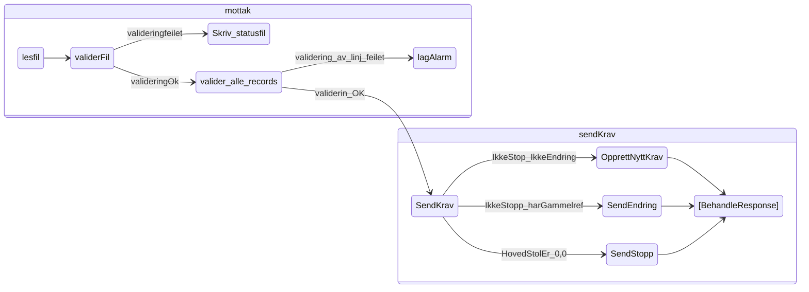
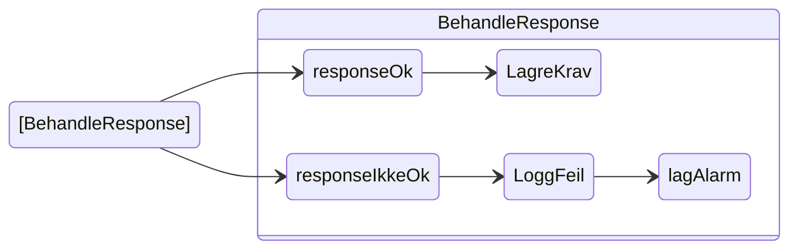

# sokos-ske-krav

# 1. Funksjonelle Krav

Applikasjonen er en tjeneste som sender tilbakekrevingskrav til Skatteetatens nye REST tjeneste, som på sikt skal
ertstatte PAK.  
Den henter flatfiler fra filmottakserveren, mapper de om til objekter, og sender kravene
ihht [SKE sin kontrakt](https://app.swaggerhub.com/apis/skatteetaten/oppdragsinnkreving-api/).
SKE sender tilbake en *kravidentifikator* som kobles til NAV sitt saksnummer for kravet og blir så lagret i database.
Oppbygninen av flatfilene er dokumentert
i [confluence](https://confluence.adeo.no/pages/viewpage.action?pageId=176706565)

# 2. Utviklingsmiljø

### Forutsetninger

* Java 21
* Gradle
* [Kotest](https://plugins.jetbrains.com/plugin/14080-kotest) plugin for å kjøre Kotest tester
* [vault](https://github.com/navikt/utvikling/blob/main/docs/teknisk/Vault.md) for å kjøre `setupLocalEnvironment.sh`
* [jq](https://github.com/stedolan/jq) for å kjøre `setupLocalEnvironment.sh`

### Bygge prosjekt

`./gradlew build shadowjar`

### Lokal utvikling

NB! Du må ha [naisdevice](https://docs.nais.io/device/) kjørende på maskinen.

For å kjøre applikasjonen må du gjøre følgende:

- Kjør scriptet [setupLocalEnvironment.sh](setupLocalEnvironment.sh)
     ```
     chmod 755 setupLocalEnvironment.sh && ./setupLocalEnvironment.sh
     ```                                
  Denne vil opprette [default.properties](defaults.properties) med alle environment variabler (bortsett fra
  POSTGRES_USERNAME og POSTGRES_PASSWORD, som må hentes manuelt fra vault) du trenger for å kjøre
  applikasjonen som er definert i [PropertiesConfig](src/main/kotlin/sokos/ske/krav/config/PropertiesConfig.kt).

### Alarmer

Applikasjonen bruker [Grafana Alerting](https://grafana.nav.cloud.nais.io/alerting/) for overvåkning og varsling.
Dette er konfigurert via NAIS sin [alerting-integrasjon](https://doc.nais.io/observability/alerts).

Alarmene overvåker metrics som:

- HTTP-feilrater
- JVM-metrikker

Varsler blir sendt til følgende Slack-kanaler:

- Dev-miljø: [#team-mob-alerts-dev](https://nav-it.slack.com/archives/C042SF2FEQM)
- Prod-miljø: [#team-mob-alerts-prod](https://nav-it.slack.com/archives/C042ESY71GX)

# 3. Programvarearkitektur






# 4. Deployment

Distribusjon av tjenesten er gjort med bruk av Github Actions.
[sokos-ske-krav CI / CD](https://github.com/navikt/sokos-ske-krav/actions)

Push/merge til master branche vil teste, bygge og deploye til produksjonsmiljø og testmiljø.

# 5. Drift og støtte

### Logging

TODO

### Alarmer

TODO

### Grafana

TODO

# 6. Henvendelser og tilgang

Spørsmål knyttet til koden eller prosjektet kan stilles som issues her på Github.\
Interne henvendelser kan sendes via Slack i kanalen `#po-utbetaling`