# sokos-ske-krav
## Lokal utvikling

NB! Du må ha [naisdevice](https://docs.nais.io/device/) kjørende på maskinen.

For å kjøre applikasjonen må du gjøre følgende:

- Kjør scriptet [setupLocalEnvironment.sh](setupLocalEnvironment.sh)
     ```
     chmod 755 setupLocalEnvironment.sh && ./setupLocalEnvironment.sh
     ```
  Denne vil opprette [default.properties](defaults.properties) med alle environment variabler (bortsett fra POSTGRES_USERNAME og POSTGRES_PASSWORD som må hentes manuelt fra vault) du trenger for å kjøre
  applikasjonen som er definert i [PropertiesConfig](src/main/kotlin/sokos/ske/krav/config/PropertiesConfig.kt).

```mermaid
stateDiagram-v2
    direction LR
    state mottak{
        direction LR
        lesfil --> validerFil
        validerFil --> Skriv_statusfil: valideringfeilet 
        validerFil --> valider_alle_records: valideringOk
        valider_alle_records --> lagAlarm: validering_av_linj_feilet
        valider_alle_records --> SendKrav:validerin_OK
    }
    state sendKrav{
        direction LR
        SendKrav --> OpprettNyttKrav:IkkeStop_IkkeEndring
        SendKrav --> SendEndring:IkkeStopp_harGammelref
        SendKrav --> SendStopp:HovedStolEr_0,0
        OpprettNyttKrav --> [BehandleResponse]
        SendEndring --> [BehandleResponse]
        SendStopp --> [BehandleResponse]
    }
```




- Legg inn dette i runconfig env
```properties
APPLICATION_PROFILE=LOCAL
FTP_SERVER=localhost
FTP_USERNAME=usernam
FTP_PASSWORD=password
FTP_DIRECTORY=/
FTP_PORT=8080
DB_HOST=host
DB_PORT=123
DB_NAME=name
DB_USERNAME=username
DB_PASSWORD=password
HIKARI_TEST_TABLE=HIKARI_TEST_TABLE
- ```