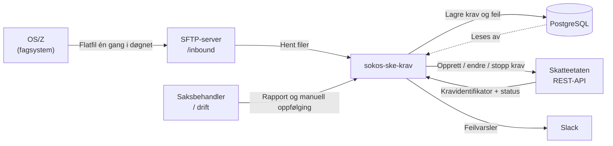
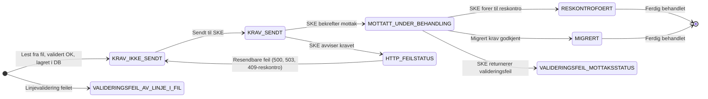

# Overordnet beskrivelse – sokos-ske-krav

## Hva er sokos-ske-krav?

sokos-ske-krav er en integrasjonstjeneste som overfører tilbakekrevingskrav fra NAV til Skatteetatens (SKE) innkrevingssystem. Tjenesten erstatter den eldre løsningen PAK og er den eneste kanalen NAV bruker for å opprette, endre og stoppe tilbakekrevingskrav mot Skatteetatens REST-API.

## Formål

Når NAV fatter vedtak om tilbakekreving av feilutbetalte stønader, må kravene sendes til Skatteetaten, som er ansvarlig for selve innkrevingen. sokos-ske-krav håndterer denne overføringen: den leser kravene fra en flatfil levert av fagsystemene, validerer dem, lagrer dem i en database og sender dem videre til SKE.

## Aktører og grensesnitt

| Aktør                            | Rolle                                        | Grensesnitt                           |
|----------------------------------|----------------------------------------------|---------------------------------------|
| OS/Z (fagsystem)                 | Produserer kravfiler én gang i døgnet        | Flatfil (fixed record) på SFTP-server |
| sokos-ske-krav                   | Leser, validerer og videresender krav        | Intern tjeneste                       |
| Skatteetaten (SKE)               | Mottar og innkrever kravene                  | REST-API (Maskinporten-sikret)        |
| Saksbehandler / drift            | Følger opp feil og utfører manuell resending | Webgrensesnitt + direkte DB-tilgang   |
| Slack (#team-best-slackbot-prod) | Mottar automatiske varsler om feil           | Slack Webhook                         |

## Overordnet flyt

## Kravtyper

Løsningen håndterer tre typer krav som korresponderer med tre ulike operasjoner mot SKE:

| Kravtype                          | Operasjon mot SKE          | Beskrivelse                                                        |
|-----------------------------------|----------------------------|--------------------------------------------------------------------|
| NYTT_KRAV                         | POST innkrevingsoppdrag    | Nytt tilbakekrevingskrav                                           |
| ENDRING_RENTE + ENDRING_HOVEDSTOL | PUT renter / PUT hovedstol | Endring av eksisterende krav (sendes alltid til begge endepunkter) |
| STOPP_KRAV                        | POST avskriving            | Avslutter innkrevingen av et krav                                  |

Hvilke stønadstyper en kravkode + hjemmelkode-kombinasjon tilhører er definert i `StonadsType`-enumen, og må koordineres med SKE dersom nye kravkoder introduseres i NAV.

## Dataflyt og livssyklus for et krav

Et krav er ferdig behandlet når det har nådd status `RESKONTROFOERT` eller `MIGRERT`. Krav som feiler med resendbare HTTP-feil (500, 503, 409 ikke-reskontroført) vil automatisk bli resendt i neste kjøring. Andre feil må håndteres manuelt ved å sette status til `KRAV_IKKE_SENDT`.

## Feilhåndtering

- **Filvalideringsfeil** – Feil i header/footer-kontroll, antall eller sum: hele filen avvises, flyttes til `/inbound/feilfiler` og alarm sendes til Slack.
- **Linjevalideringsfeil** – Ugyldig enkeltlinje: linjen hoppes over og lagres i `filvalideringsfeil`-tabellen.
- **SKE-feil** – HTTP 4xx/5xx fra SKE: lagres i `feilmelding`-tabellen og varsles til Slack. De fleste skyldes forretningsregler (endring på ikke-reskontroført krav, opphørt organisasjon, «dobbel endring på migrert krav»).
- **Teknisk nedetid hos SKE** – Circuit Breaker stopper all sending og åpner igjen automatisk etter konfigurerbart intervall (default 4 timer). Krav resendes automatisk neste kjøring.

Alle funksjonelle feil håndteres av produkteier og/eller fagsiden. Tekniske feil varsles i `#team-mob-alerts-prod` og meldes til SKE via `#utbetaling-tilbakekreving-fi`.

## Kjøreplan og triggere

Tjenesten kjøres periodisk (konfigurerbart, typisk ca. hvert 5. time) og kan i tillegg trigges manuelt:

| Trigger               | Endepunkt           | Funksjon                         |
|-----------------------|---------------------|----------------------------------|
| Periodisk (scheduler) | –                   | Henter nye filer og sender krav  |
| Manuell HTTP          | GET /api/hentNye    | Starter ny kjøring umiddelbart   |
| Manuell HTTP          | GET /api/hentStatus | Oppdaterer mottaksstatus fra SKE |

## Avhengigheter

| Avhengighet     | Type        | Formål                                        |
|-----------------|-------------|-----------------------------------------------|
| SKE SFTP-server | Ekstern     | Kildene til kravfilene                        |
| SKE REST-API    | Ekstern     | Mottar og behandler kravene                   |
| Maskinporten    | Ekstern IDP | OAuth2-tokens for autentisering mot SKE       |
| PostgreSQL      | Intern DB   | Lagrer krav, feilmeldinger og valideringsfeil |
| Slack Webhook   | Ekstern     | Varsling om feil og avvik                     |

## Sentrale begreper

Se [Begrepsforklaring](../../funksjonalitet/Begrepsforklaring.md) for fullstendig ordliste over begreper i NAV og SKE-kontekst.

## Relatert dokumentasjon

| Dokument                                                     | Innhold                                          |
|--------------------------------------------------------------|--------------------------------------------------|
| [Funksjonell flyt](../../arkitektur/Funksjonell_flyt.md)     | Detaljerte sekvens- og flytdiagrammer            |
| [Systemarkitektur](../../arkitektur/Systemarkitektur.md)     | Komponent- og infrastrukturdiagrammer            |
| [Databasestruktur](../../funksjonalitet/Databasestruktur.md) | Tabeller, kolonner og migrasjonshistorikk        |
| [Stønadstyper](../../funksjonalitet/Stonadstyper.md)         | Fullstendig kravkode + hjemmelkode-mappingtabell |
| [Drift](../../Drift.md)                                      | BAU-oppgaver, kubectl-kommandoer og alarmoppsett |
| [Feilretting Guide](../../Feilretting_Guide.md)              | Konkrete feilscenarioer og tiltak                |
