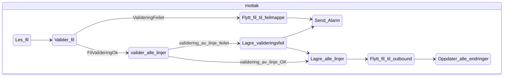
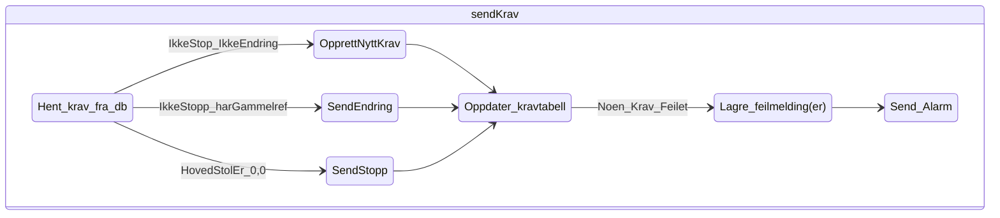
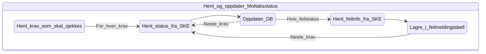

## Funksjonell flyt

```mermaid
stateDiagram-v2
    direction LR
    state mottak {
        direction LR
        Les_fil --> Valider_fil
        Valider_fil --> Flytt_fil_til_feilmappe: ValideringFeilet
        Flytt_fil_til_feilmappe --> Send_Alarm
        Valider_fil --> valider_alle_linjer: FilValideringOk
        valider_alle_linjer --> Lagre_valideringsfeil: validering_av_linje_feilet
        Lagre_valideringsfeil --> Send_Alarm
        Lagre_valideringsfeil --> Lagre_alle_linjer
        valider_alle_linjer --> Lagre_alle_linjer: validering_av_linje_OK
        Lagre_alle_linjer --> Flytt_fil_til_outbound
        Flytt_fil_til_outbound --> Oppdater_alle_endringer
    }
```

```mermaid
stateDiagram-v2
state sendKrav {
direction LR
Hent_krav_fra_db --> OpprettNyttKrav: IkkeStop_IkkeEndring
Hent_krav_fra_db --> SendEndring: IkkeStopp_harGammelref
Hent_krav_fra_db --> SendStopp: HovedStolEr_0,0
OpprettNyttKrav --> Oppdater_kravtabell
SendEndring --> Oppdater_kravtabell
SendStopp --> Oppdater_kravtabell
Oppdater_kravtabell --> Lagre_feilmelding(er): Noen_Krav_Feilet
Lagre_feilmelding(er) -->  Send_Alarm
}
```

```mermaid
stateDiagram-v2
state Hent_og_oppdater_Mottaksstatus {
direction LR
Hent_krav_som_skal_sjekkes --> Hent_status_fra_SKE: For_hver_krav
Hent_status_fra_SKE --> Oppdater_DB
Oppdater_DB --> Hent_feilinfo_fra_SKE: Hvis_feilstatus
Oppdater_DB --> Hent_status_fra_SKE: Neste_krav
Hent_feilinfo_fra_SKE --> Lagre_i_feilmeldingtabell
Lagre_i_feilmeldingtabell --> Hent_status_fra_SKE: Neste_krav
}
```