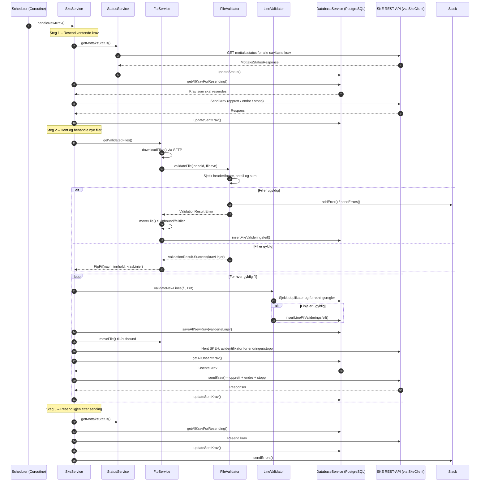
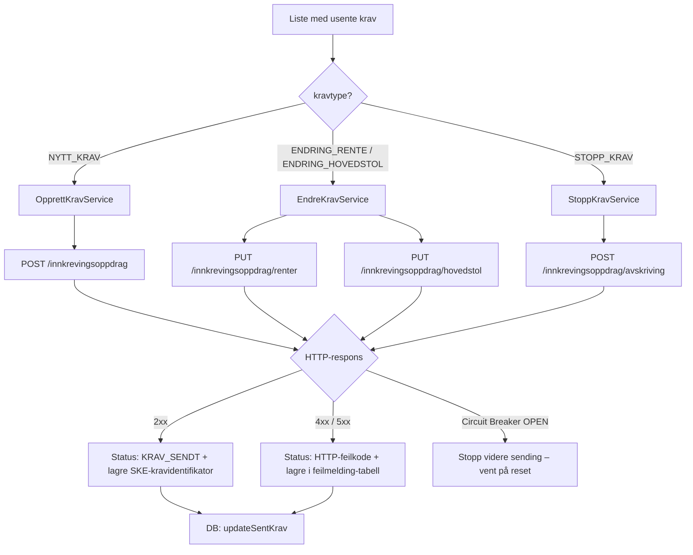
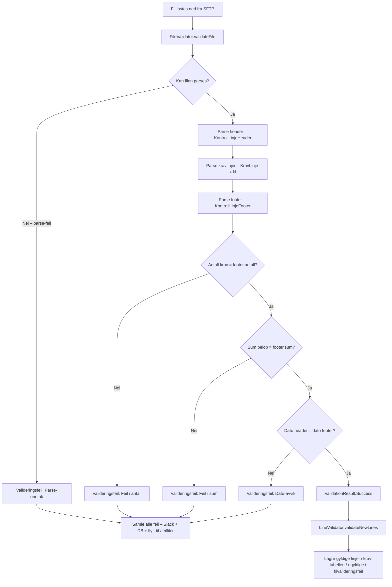
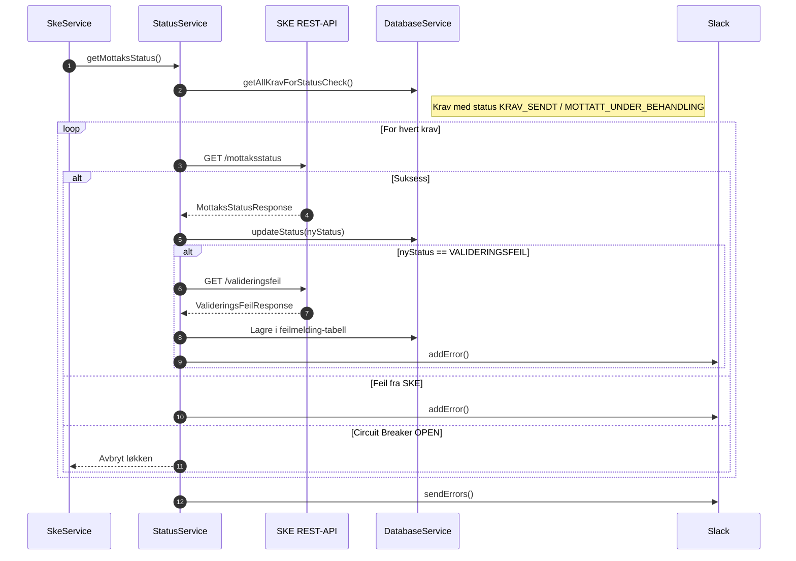
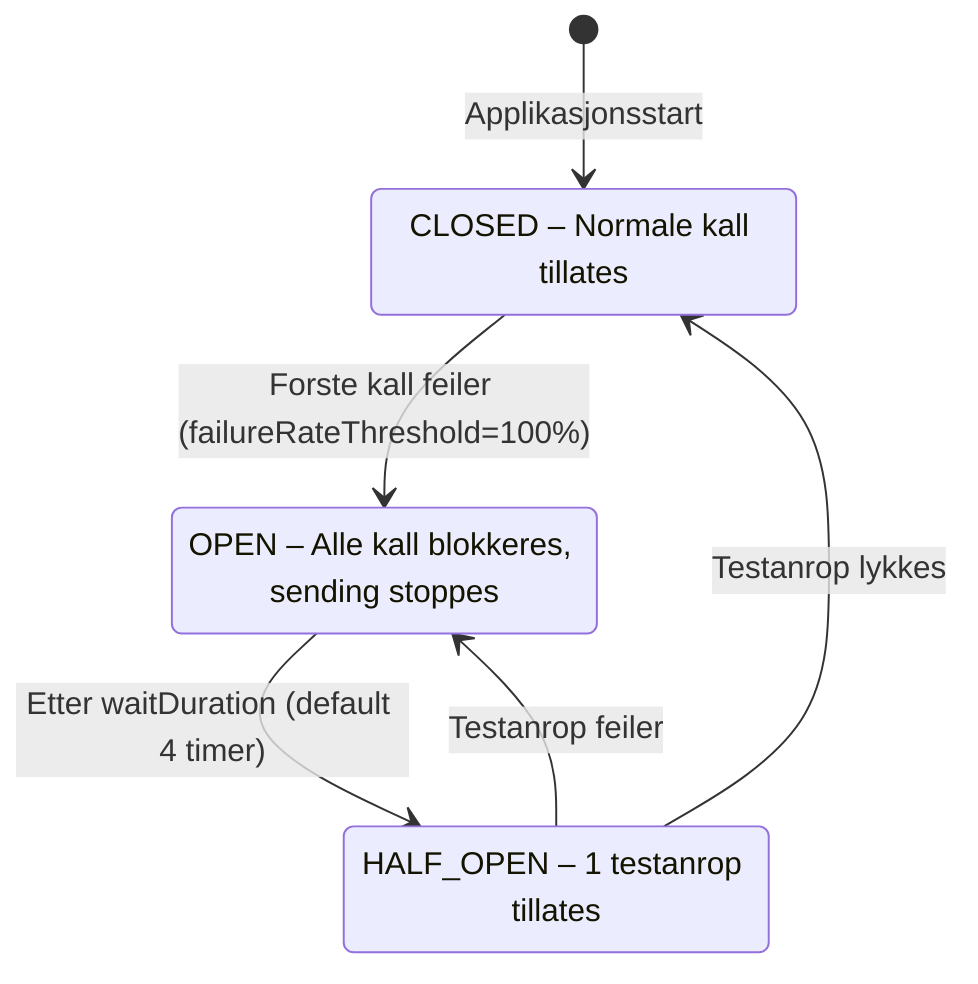
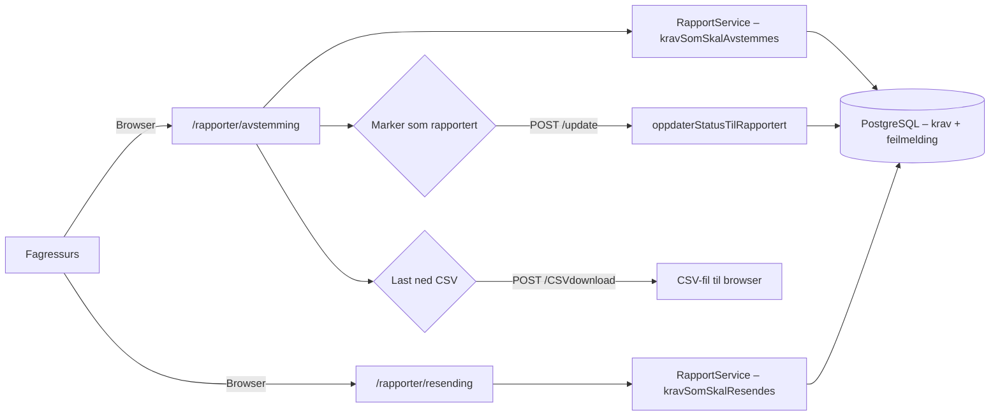

# Funksjonell flyt
Beskrivelse av de viktigste prosessene i sokos-ske-krav, med sekvensdiagrammer.
## Oversikt over kjøreløkken

Applikasjonen kjører to periodiske jobber:

| Jobb                                                                                         | Intervall                        | Funksjon                                                            |
|----------------------------------------------------------------------------------------------|----------------------------------|---------------------------------------------------------------------|
| [`handleNewKrav`](../../src/main/kotlin/no/nav/sokos/ske/krav/service/SkeService.kt)         | Konfigurerbart (default 5 timer) | Henter nye filer fra SFTP, validerer, lagrer og sender krav til SKE |
| [`checkKravDateForAlert`](../../src/main/kotlin/no/nav/sokos/ske/krav/service/SkeService.kt) | Hvert 24. time                   | Varsler på Slack dersom krav har stått ubehandlet for lenge         |

---
## 1. Hovedflyt – behandling av nye kravfiler

---
## 2. Sending av krav til SKE
Krav sendes i tre varianter avhengig av `kravtype`:

### Statuskoder

| Status                           | Beskrivelse                                                                                                                                                         |
|----------------------------------|---------------------------------------------------------------------------------------------------------------------------------------------------------------------|
| `KRAV_IKKE_SENDT`                | Initial status for gyldige krav etter innlesing. Brukes også ved automatisk resending etter feil                                                                    |
| `KRAV_SENDT`                     | Krav er sendt til SKE og venter på statusbekreftelse                                                                                                                |
| `MOTTATT_UNDER_BEHANDLING`       | SKE har bekreftet mottak, kravet er til behandling                                                                                                                  |
| `RESKONTROFOERT`                 | SKE har reskontroført kravet – endelig status, ingen videre behandling                                                                                              |
| `MIGRERT`                        | Migrert krav er godkjent av SKE – endelig status                                                                                                                    |
| `VALIDERINGSFEIL_AV_LINJE_I_FIL` | Linjen feilet intern validering og vil ikke sendes til SKE                                                                                                          |
| `VALIDERINGSFEIL_MOTTAKSSTATUS`  | SKE returnerte valideringsfeil ved statussjekk                                                                                                                      |
| `HTTP4xx` / `HTTP5xx`            | Ulike HTTP-feilstatuser fra SKE (se detaljert tabell i [SKE_requests_og_feilhandtering.md](../beskrivelse/detaljert/SKE_requests_og_feilhandtering.md))             |
| `UKJENT_FEIL`                    | Ukjent feiltype                                                                                                                                                     |
| `UKJENT_STATUS`                  | Statusen kunne ikke bestemmes (brukes bl.a. ved statuskonformering i [`EndreKravService`](../../src/main/kotlin/no/nav/sokos/ske/krav/service/EndreKravService.kt)) |
| `KRAV_INNLEST_FRA_FIL`           | Definert som fallback i `insertAllNewKrav`, men brukes **aldri i praksis** siden `LineValidator` alltid setter status eksplisitt                                    |
---
## 3. Filvalidering

---
## 4. Statussjekk og reskontroføring

---
## 5. Circuit Breaker

Når Circuit Breaker er **OPEN** stopper applikasjonen all videre sending i inneværende kjøring. Neste planlagte kjøring starter med ny sjekk av status.

---
## 6. Rapport og manuell oppfølging

Rapportvisningen brukes til:
- **Avstemming** – følge opp krav med feil-statuser som krever manuell handling (via [`RapportService.kravSomSkalAvstemmes`](../../src/main/kotlin/no/nav/sokos/ske/krav/service/RapportService.kt))
- **Resending** – se hvilke krav som er i kø for automatisk resending (via [`RapportService.kravSomSkalResendes`](../../src/main/kotlin/no/nav/sokos/ske/krav/service/RapportService.kt))
