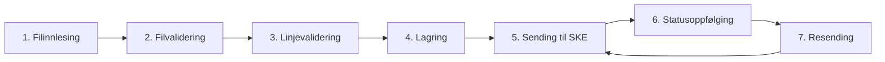

# Overordnet flytdiagram

Applikasjonens prosesseringsflyt brutt ned i separate steg.

## Steg

| # | Steg | Beskrivelse | Diagram |
|---|------|-------------|---------|
| 1 | [Filinnlesing](flytdiagram/01_filinnlesing.md) | Hent flatfiler fra SFTP og parse fixed-width format |
| 2 | [Filvalidering](flytdiagram/02_filvalidering.md) | Verifiser filintegritet (antall, sum, datoer) |
| 3 | [Linjevalidering](flytdiagram/03_linjevalidering.md) | Valider forretningsregler per kravlinje |
| 4 | [Lagring](flytdiagram/04_lagring.md) | Persist krav til database med initial status |
| 5 | [Sending](flytdiagram/05_sending.md) | Send krav til SKE fordelt på kravtype |
| 6 | [Statusoppfølging](flytdiagram/06_statusoppfolging.md) | Poll SKE for mottaksstatus og oppdater DB |
| 7 | [Resending](flytdiagram/07_resending.md) | Plukk opp feilede krav og send på nytt |
