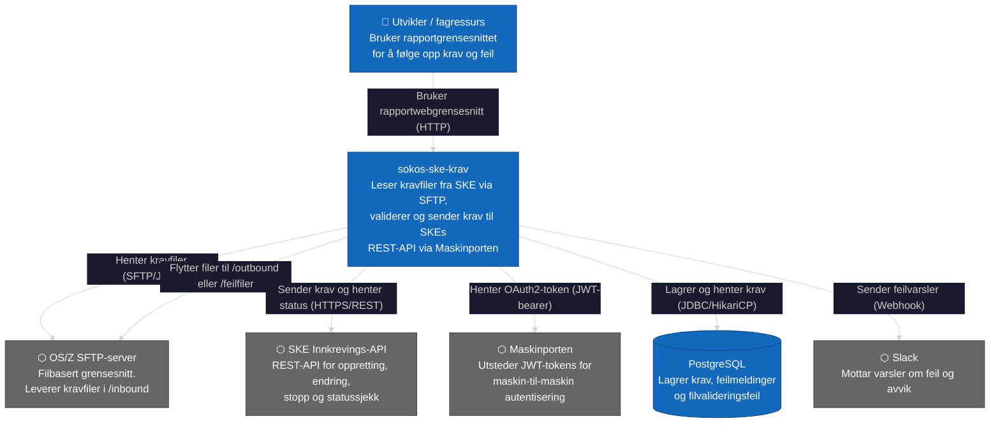
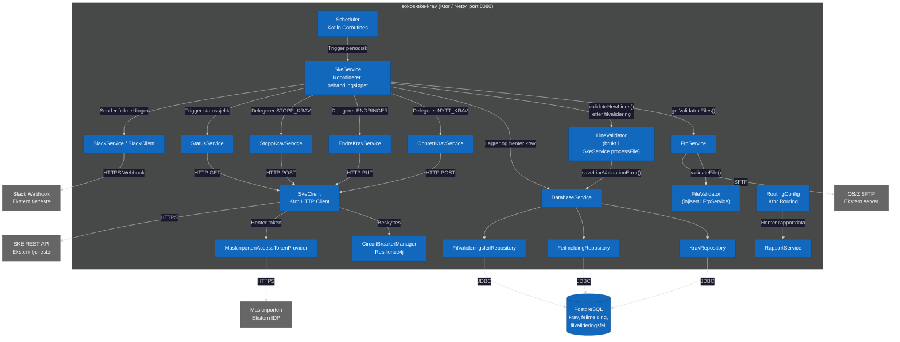

# Systemarkitektur

Oversikt over sokos-ske-krav sin plass i NAVs tekniske landskap og samspillet mellom de ulike komponentene.

## Systemoversikt

## Komponentdiagram

## Infrastruktur og deploymentmiljø

| Egenskap           | Verdi                                                                    |
|--------------------|--------------------------------------------------------------------------|
| Plattform          | NAIS (Kubernetes) på `fss`-sonen                                         |
| Miljøer            | `dev-fss`, `prod-fss`                                                    |
| Applikasjonsserver | Ktor med Netty, port `8080`                                              |
| Autentisering inn  | Basic Auth (webgrensesnitt /rapporter/*)                                 |
| Autentisering ut   | Maskinporten (JWT-bearer)                                                |
| Database           | PostgreSQL (HikariCP connection pool, Flyway migrasjoner)                |
| Filoverføring      | SFTP via JSch med RSA-nøkkelautentisering                                |
| Feilhåndtering     | Resilience4j Circuit Breaker + Slack-varsler                             |
| Observability      | Prometheus-metrikker, Logback (JSON-logging), team-logs-marker           |

## Teknologistack

| Kategori           | Teknologi                    |
|--------------------|------------------------------|
| Språk              | Kotlin (JVM)                 |
| Rammeverk          | Ktor (server og HTTP-klient) |
| Database-migrering | Flyway                       |
| Connection pool    | HikariCP                     |
| SFTP-klient        | JSch                         |
| Autentisering      | Maskinporten (JWT)           |
| Resilience         | Resilience4j CircuitBreaker  |
| Metrikker          | Micrometer / Prometheus      |
| Logging            | KotlinLogging / Logback      |
| Konfigurasjon      | Konfig (natpryce)            |
| Serialisering      | kotlinx.serialization        |
