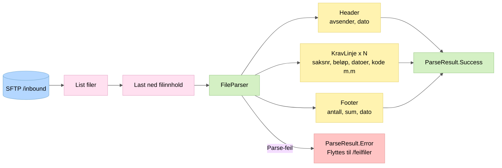

# 1. Filinnlesing

Henter flatfiler fra SFTP-server og parser fixed-width copybook-format til strukturerte objekter.

## Nøkkelpunkter

- Filene er fixed-width (byte-offsets per felt) fra OS, Arena, Infotrygd, Pesys
- Hver fil har nøyaktig én header-linje, N kravlinjer, og én footer-linje
- Filer som ikke kan parses flyttes til `/inbound/feilfiler` og behandles ikke videre
