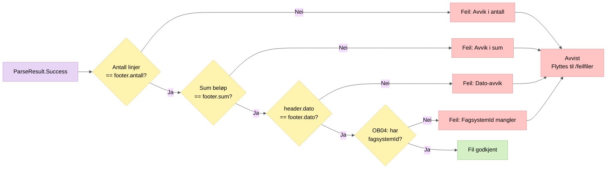

# 2. Filvalidering

Verifiserer at filen er konsistent – at header, footer og innhold stemmer overens.

## Valideringsregler

| Regel | Sjekk |
|-------|-------|
| Antall | Antall kravlinjer i filen == `footer.antallTransaksjoner` |
| Sum | `sum(belop + belopRente)` for alle linjer == `footer.sumAlleTransaksjoner` |
| Dato | `header.transaksjonsDato` == `footer.transaksjonTimestamp` |
| FagsystemId | Alle kravlinjer fra avsender OB04 må ha `fagsystemId` |
