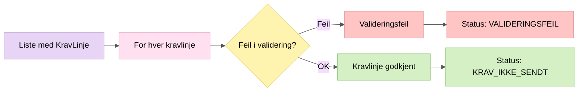

# 3. Linjevalidering

Validerer hver enkelt kravlinje mot SKEs synkrone valideringsregler og interne forretningsregler.

## Valideringsregler

| Felt | Regel |
|------|-------|
| vedtaksDato | Kan ikke være i fremtiden |
| utbetalingsDato | Må være før vedtaksDato (tom verdi tillatt for Arena/Pesys/Infotrygd) |
| periodeFOM/TOM | FOM ≤ TOM, TOM < første dag neste måned |
| tilleggsfrist | Ikke eldre enn 10 måneder fra i dag |
| gjelderId | Kan ikke være blank |
| beløp (hovedstol) | Kan ikke være negativt |
| saksnummerNAV | Må matche `^[a-zA-Z0-9-/]+$` |
| kravKode + kodeHjemmel | Må finnes i `StonadsType`-mapping |
| referansenummerGammelSak | Påkrevd for stopp, gyldig format for endring/stopp |
| fagsystemId | Påkrevd for avsender OB04 |

## Viktig

- Ugyldige linjer lagres likevel i databasen (for sporbarhet), men sendes aldri til SKE
- Gyldige og ugyldige linjer fra samme fil behandles uavhengig
