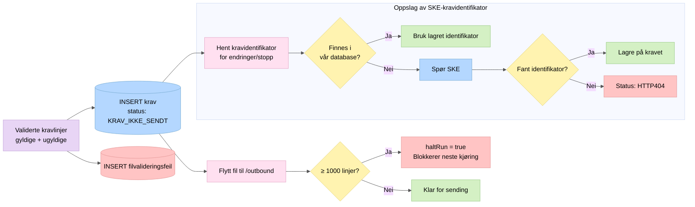

# 4. Lagring

Etter validering lagres alle kravlinjer i databasen. Filen flyttes til `/outbound`.

## Nøkkelpunkter

- Alle linjer (gyldige og ugyldige) lagres for sporbarhet
- `haltRun`-mekanismen forhindrer at neste scheduler-kjøring starter ved store filer
- For endringer og stopp trengs SKEs `kravidentifikator` – den slås opp lokalt først, deretter mot SKE
