# 5. Sending til SKE

Krav sendes til Skatteetatens REST API fordelt på kravtype. Alle kall går gjennom Circuit Breaker og autentiseres med Maskinporten.

```mermaid
%%{init: {'theme': 'base', 'themeVariables': {'background': '#ffffff', 'primaryTextColor': '#000000', 'secondaryTextColor': '#000000', 'tertiaryTextColor': '#000000', 'lineColor': '#555555', 'textColor': '#000000'}, 'flowchart': {'wrappingWidth': 200, 'padding': 15, 'nodeSpacing': 30, 'rankSpacing': 40}}}%%
flowchart LR
    Input[Krav med status<br/>KRAV_IKKE_SENDT] --> Split{Kravtype?}

    Split -->|NYTT_KRAV| Opprett[OpprettKravService]
    Split -->|ENDRING| Endre[EndreKravService]
    Split -->|STOPP_KRAV| Stopp[StoppKravService]

    Opprett --> PostOpprett[POST /innkrevingsoppdrag]
    PostOpprett --> OpprettOK[Motta kravident fra SKE]

    Endre --> Group[Grupper per identifikator]
    Group --> SendRente[PUT .../renter]
    Group --> SendHovedstol[PUT .../hovedstol]
    SendRente --> Conform[Konformer status]
    SendHovedstol --> Conform

    Stopp --> PostStopp[POST .../avskriving]

    OpprettOK --> UpdateDB[(UPDATE krav status)]
    Conform --> UpdateDB
    PostStopp --> UpdateDB


    style Input fill:#e8d5f5,stroke:#c4a4d9,color:#000
    style Split fill:#fff3b0,stroke:#e6d476,color:#000
    style Opprett fill:#ffe0f0,stroke:#e6a8c8,color:#000
    style Endre fill:#b4d7ff,stroke:#7baed4,color:#000
    style Stopp fill:#ffd4b8,stroke:#e6a87a,color:#000
    style PostOpprett fill:#ffe0f0,stroke:#e6a8c8,color:#000
    style OpprettOK fill:#d4f0c4,stroke:#9dcc8a,color:#000
    style Group fill:#b4d7ff,stroke:#7baed4,color:#000
    style SendRente fill:#b4d7ff,stroke:#7baed4,color:#000
    style SendHovedstol fill:#b4d7ff,stroke:#7baed4,color:#000
    style Conform fill:#e8d5f5,stroke:#c4a4d9,color:#000
    style PostStopp fill:#ffd4b8,stroke:#e6a87a,color:#000
    style UpdateDB fill:#d4f0c4,stroke:#9dcc8a,color:#000

```

## Endring – statuskonformering
                        
Når et krav er en endring blir det "splittet" og sendt inn til to forskjellige endepunkter (endreHovedstol, endreRenter) og status fra disse konformeres med denne prioriteten:

| Prioritet | HTTP-kode | Betydning |
|-----------|-----------|-----------|
| 1 (høyest) | 404 | Kravet eksisterer ikke hos SKE |
| 2 | 422 | Valideringsfeil |
| 3 | 409 | Forretningskonflikt |
| 4 | Annet | Ukjent status |

## Statusovergang ved sending

| HTTP-respons | Ny status i DB |
|---|---|
| 2xx | `KRAV_SENDT` |
| 4xx/5xx | Feilstatus basert på HTTP-kode (f.eks. `HTTP409_KONFLIKT`) |
| Circuit Breaker OPEN | Sending avbrytes, status uendret |
