# 5a. Splitting av endringskrav

Når en kravlinje er en **endring**, splittes den i to separate krav ved lagring. Disse sendes til hvert sitt SKE-endepunkt, og responsene konformeres til én felles status.

```mermaid
%%{init: {'theme': 'base', 'themeVariables': {'background': '#ffffff', 'primaryTextColor': '#000000', 'secondaryTextColor': '#000000', 'tertiaryTextColor': '#000000', 'lineColor': '#555555', 'textColor': '#000000'}, 'flowchart': {'wrappingWidth': 200, 'padding': 15, 'nodeSpacing': 30, 'rankSpacing': 40}}}%%
flowchart LR
    Input[KravLinje<br/>kravtype: ENDRING] --> Split{isEndring?}

    Split -->|Ja| InsertH[(INSERT krav<br/>kravtype: ENDRING_HOVEDSTOL)]
    Split -->|Ja| InsertR[(INSERT krav<br/>kravtype: ENDRING_RENTE)]

    InsertH --> GroupBy[Grupper per<br/>kravidentifikator + saksnummer]
    InsertR --> GroupBy

    GroupBy --> SendH[PUT .../hovedstol<br/>endreHovedstol]
    GroupBy --> SendR[PUT .../renter<br/>endreRenter]

    SendH --> RespH[HTTP-respons<br/>hovedstol]
    SendR --> RespR[HTTP-respons<br/>renter]

    RespH --> Conform{Samme status?}
    RespR --> Conform

    Conform -->|Ja| UseStatus[Bruk felles status]
    Conform -->|Nei| Priority[Konformer etter prioritet]

    Priority --> P1[1. 404 → Kravet finnes ikke]
    Priority --> P2[2. 422 → Valideringsfeil]
    Priority --> P3[3. 409 → Forretningskonflikt]
    Priority --> P4[4. Annet → UKJENT_STATUS]

    UseStatus --> UpdateDB[(UPDATE begge krav<br/>med konformert status)]
    P1 --> UpdateDB
    P2 --> UpdateDB
    P3 --> UpdateDB
    P4 --> UpdateDB

    style Input fill:#e8d5f5,stroke:#c4a4d9,color:#000
    style Split fill:#fff3b0,stroke:#e6d476,color:#000
    style InsertH fill:#b4d7ff,stroke:#7baed4,color:#000
    style InsertR fill:#ffe0f0,stroke:#e6a8c8,color:#000
    style GroupBy fill:#e8d5f5,stroke:#c4a4d9,color:#000
    style SendH fill:#b4d7ff,stroke:#7baed4,color:#000
    style SendR fill:#ffe0f0,stroke:#e6a8c8,color:#000
    style RespH fill:#b4d7ff,stroke:#7baed4,color:#000
    style RespR fill:#ffe0f0,stroke:#e6a8c8,color:#000
    style Conform fill:#fff3b0,stroke:#e6d476,color:#000
    style UseStatus fill:#d4f0c4,stroke:#9dcc8a,color:#000
    style Priority fill:#ffd4b8,stroke:#e6a87a,color:#000
    style P1 fill:#ffc4c4,stroke:#e69a9a,color:#000
    style P2 fill:#ffc4c4,stroke:#e69a9a,color:#000
    style P3 fill:#ffc4c4,stroke:#e69a9a,color:#000
    style P4 fill:#ffc4c4,stroke:#e69a9a,color:#000
    style UpdateDB fill:#d4f0c4,stroke:#9dcc8a,color:#000
```

## Forklaring

1. **Splitting ved lagring** (`KravRepository.insertAllNewKrav`): Én `KravLinje` med `isEndring() == true` resulterer i to rader i `krav`-tabellen — én med kravtype `ENDRING_HOVEDSTOL` og én med `ENDRING_RENTE`.

2. **Gruppering** (`EndreKravService.sendAllEndreKrav`): Kravene grupperes etter `kravidentifikatorSKE + saksnummerNAV` slik at hovedstol og rente for samme krav behandles sammen.

3. **Sending** (`EndreKravService.sendEndreKrav`): Hvert krav sendes til sitt respektive endepunkt — `PUT .../hovedstol` eller `PUT .../renter`.

4. **Statuskonformering** (`EndreKravService.getConformedResponses`): Dersom de to responsene gir ulik status, velges den mest alvorlige etter prioritet:
   - **404** har høyest prioritet (kravet eksisterer ikke hos SKE)
   - **422** neste (valideringsfeil)
   - **409** deretter (forretningskonflikt)
   - Alt annet → `UKJENT_STATUS`

   Begge kravene oppdateres med den konformerte statusen.
