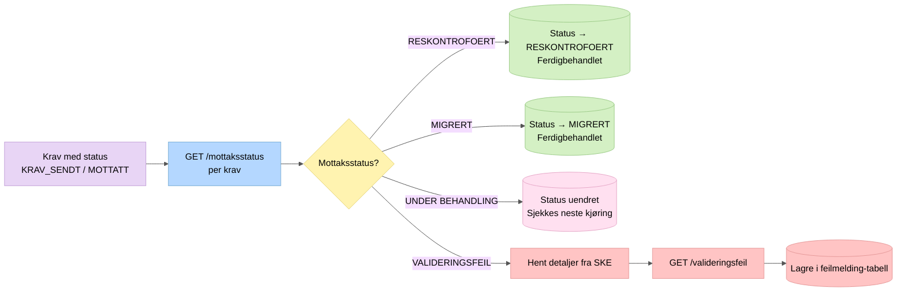
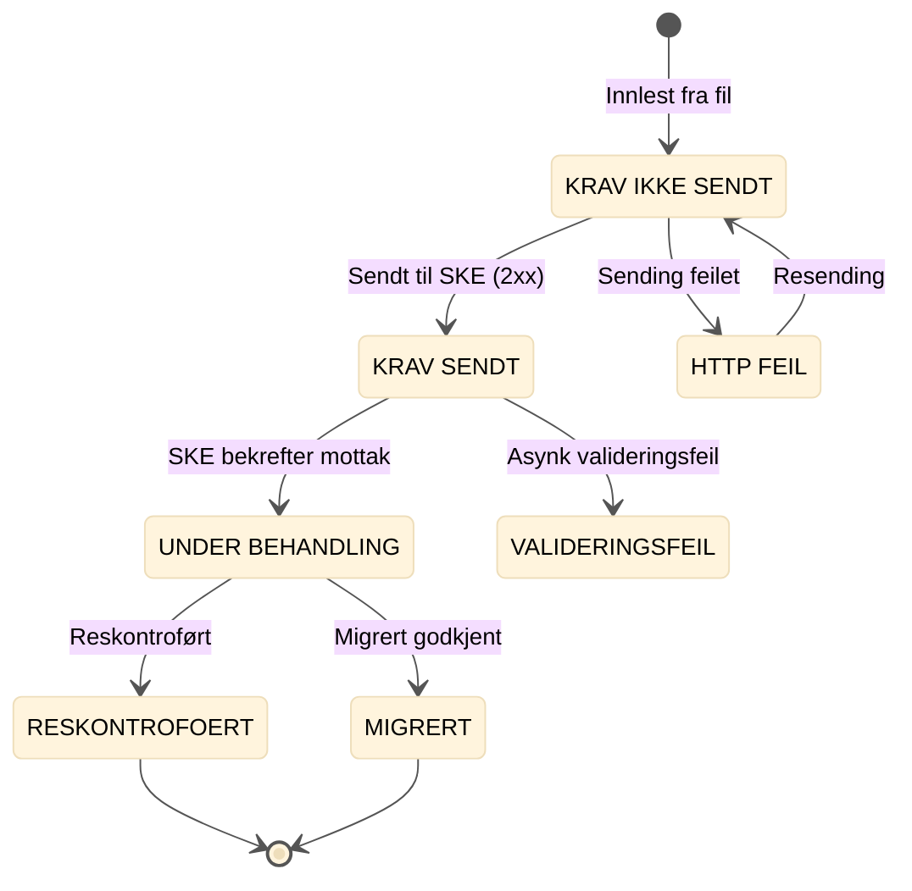

# 6. Statusoppfølging

Poller SKE for mottaksstatus på krav som er sendt men ikke ferdigbehandlet.

## Statuslivssyklus

## Endelige statuser (ingen videre behandling)

- `RESKONTROFOERT` – kravet er innkrevd
- `MIGRERT` – migrert krav er akseptert
- `VALIDERINGSFEIL_AV_LINJE_I_FIL` – intern valideringsfeil, sendes aldri
- `VALIDERINGSFEIL` – SKE avviste kravet asynkront
