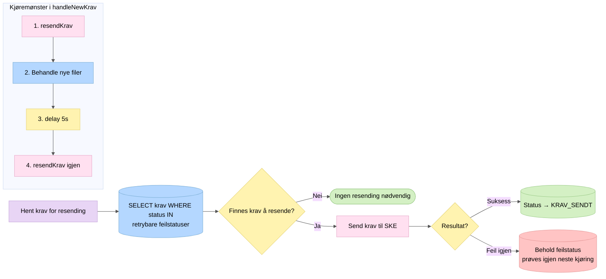

# 7. Resending

Krav som feilet med retrybare statuser plukkes opp og sendes på nytt.

## Retrybare statuser

Krav med disse statusene plukkes opp for automatisk resending:

| Status | Årsak |
|--------|-------|
| `HTTP409_*_RESEND` | Konflikt som kan løses ved retry |
| `HTTP500_*` | Serverfeil hos SKE |
| `HTTP503_*` | SKE midlertidig utilgjengelig |

## Stagnerende krav

Krav som har vært forsøkt resendt i over 24 timer uten suksess fanges opp av en separat jobb (`checkForStangendeKrav`) som kjører daglig. Disse krever manuell oppfølging.
