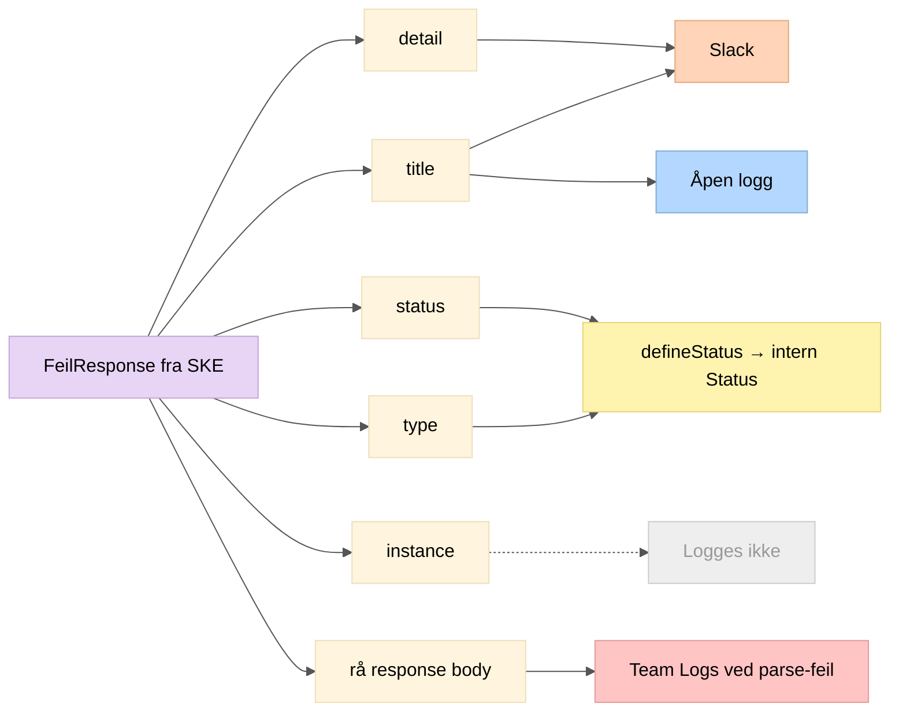
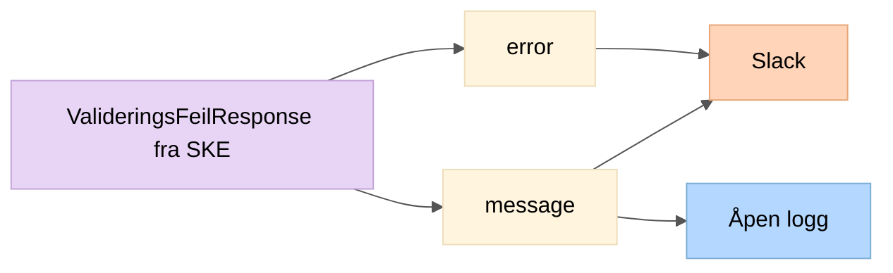

# Logging av SKE HTTP-responser

Oversikt over hvilke felter fra SKE-responser som logges til åpen logg, Team Logs og Slack.

---

## 1. Responstyper fra SKE

### FeilResponse (synkron feil)

```json
{
  "type": "innkrevingsoppdrag-eksisterer-ikke",
  "title": "Innkrevingsoppdrag eksisterer ikke",
  "status": 404,
  "detail": "Fant ikke innkrevingsoppdrag med oppgitt kravidentifikator",
  "instance": "/innkrevingsoppdrag/ABC123/mottaksstatus"
}
```

### ValideringsFeilResponse (asynkron validering via mottaksstatus)

```json
{
  "valideringsfeil": [
    { "error": "PERSON_EKSISTERER_IKKE", "message": "Personen eksisterer ikke i folkeregisteret" }
  ]
}
```

---

## 2. Loggdestinasjoner per felt – FeilResponse



---

## 3. Detaljert tabell – FeilResponse-felter

| Felt | Åpen logg (Grafana Loki) | Slack | Team Logs |
|------|--------------------------|-------|-----------|
| `type` | Nei | Nei (brukes kun til statusmapping) | Nei |
| `title` | Ja — `"{kall} feilet: {title}"` | Ja — vises som **Feilmelding**-header | Nei |
| `status` | Nei | Nei | Nei |
| `detail` | Nei | Ja — vises som **Info**-beskrivelse | Nei |
| `instance` | Nei | Nei | Nei |
| Rå response body | Nei | Nei | Ja — ved feil i JSON-parsing |

### Tilleggsdata som inkluderes

| Data | Åpen logg | Slack |
|------|-----------|-------|
| `saksnummerNAV` | Nei | Ja — vises som **Saksnummer** |
| Filnavn | Ja (aggregert) | Ja — vises som **Filnavn**-header |

---

## 4. Loggdestinasjoner per felt – ValideringsFeilResponse



### Detaljert tabell

| Felt | Åpen logg | Slack | Team Logs |
|------|-----------|-------|-----------|
| `error` | Nei | Ja — vises som **Feilmelding**-header | Nei |
| `message` | Ja — `"Asynk valideringsfeil mottatt: {message}"` | Ja — vises som **Info**-beskrivelse | Nei |

---

## 5. Oversikt over loggdestinasjoner

| Destinasjon | Hva logges | Hvem ser det | Kilde i kode |
|-------------|-----------|--------------|--------------|
| **Grafana Loki** (åpen logg) | `title`, aggregert statistikk, advarsler | Alle med tilgang til Grafana | `logger.info/warn/error` uten marker |
| **Team Logs** | Parse-feil med rå response body | Kun teamet | `logger.error(marker = TEAM_LOGS_MARKER)` |
| **Slack** (lukket kanal) | `title` + `detail` + saksnummer | Teamet via Slack | `SlackService` → `SlackClient` |
| **Slack** (via Grafana Alerting) | `logger.error`-meldinger (stangende krav) | Teamet via Slack | Grafana alert rules |
