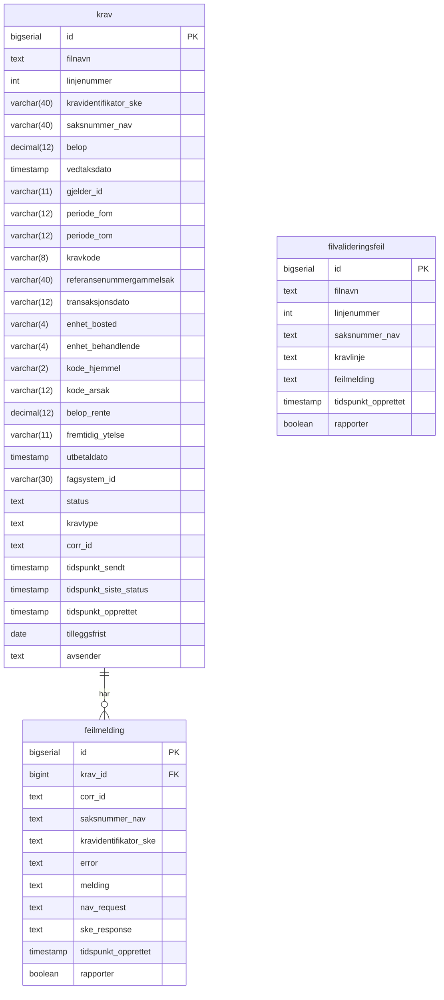

# Databasestruktur

Oversikt over tabeller og kolonner i databasen. Diagrammet viser den gjeldende strukturen etter alle migrasjoner.

## Tabellbeskrivelser

### `krav`

Hovedtabellen som lagrer innkommende krav fra SKE. Hvert krav representerer én linje fra en innlest fil.

| Kolonne                    | Type        | Beskrivelse                                              |
|----------------------------|-------------|----------------------------------------------------------|
| `id`                       | bigserial   | Primærnøkkel, auto-generert                              |
| `filnavn`                  | text        | Navn på kildefilen kravet ble lest fra                   |
| `linjenummer`              | int         | Linjenummeret i kildefilen                               |
| `kravidentifikator_ske`    | varchar(40) | SKEs unike identifikator for kravet                      |
| `saksnummer_nav`           | varchar(40) | Tilhørende saksnummer i NAV                              |
| `belop`                    | decimal(12) | Kravets beløp                                            |
| `vedtaksdato`              | timestamp   | Dato for vedtaket                                        |
| `gjelder_id`               | varchar(11) | Fødselsnummer/D-nummer kravet gjelder                    |
| `periode_fom`              | varchar(12) | Periode fra og med                                       |
| `periode_tom`              | varchar(12) | Periode til og med                                       |
| `kravkode`                 | varchar(8)  | Kode som identifiserer kravtype                          |
| `referansenummergammelsak` | varchar(40) | Referansenummer fra original sak eller endring           |
| `transaksjonsdato`         | varchar(12) | Dato for transaksjonen                                   |
| `enhet_bosted`             | varchar(4)  | Bostedsenhet                                             |
| `enhet_behandlende`        | varchar(4)  | Behandlende enhet                                        |
| `kode_hjemmel`             | varchar(2)  | Hjemmelskode                                             |
| `kode_arsak`               | varchar(12) | Årsakskode                                               |
| `belop_rente`              | decimal(12) | Rentebeløp                                               |
| `fremtidig_ytelse`         | varchar(11) | Fremtidig ytelse                                         |
| `utbetaldato`              | timestamp   | Utbetalingsdato                                          |
| `fagsystem_id`             | varchar(30) | ID i fagsystemet                                         |
| `status`                   | text        | Kravets nåværende status                                 |
| `kravtype`                 | text        | Type krav                                                |
| `corr_id`                  | text        | Korrelasjon-ID for sporing                               |
| `tidspunkt_sendt`          | timestamp   | Tidspunkt kravet ble sendt videre                        |
| `tidspunkt_siste_status`   | timestamp   | Tidspunkt for siste statusendring (default: NOW())       |
| `tidspunkt_opprettet`      | timestamp   | Tidspunkt kravet ble opprettet (default: NOW())          |
| `tilleggsfrist`            | date        | Eventuell tilleggsfrist for kravet *(lagt til i V1.0.4)* |
| `avsender`                 | text        | Avsender av kravet, f.eks. `OB04` *(lagt til i V1.0.5)*  |

**Indekser:** 
  - `idxstatus` på kolonnen `status`.
  - `idx_krav_opprettet` på kolonnen `tidspunkt_opprettet`.

---

### `feilmelding`

Lagrer feilmeldinger som oppstår ved behandling av krav mot NAV/SKE sine systemer.

| Kolonne                 | Type      | Beskrivelse                                                      |
|-------------------------|-----------|------------------------------------------------------------------|
| `id`                    | bigserial | Primærnøkkel, auto-generert                                      |
| `krav_id`               | bigint    | Referanse til `krav.id`                                          |
| `corr_id`               | text      | Korrelasjon-ID for sporing                                       |
| `saksnummer_nav`        | text      | Saksnummer i NAV                                                 |
| `kravidentifikator_ske` | text      | SKEs kravidentifikator                                           |
| `error`                 | text      | Feilkode/feiltype                                                |
| `melding`               | text      | Feilmeldingstekst                                                |
| `nav_request`           | text      | Requesten sendt til NAV                                          |
| `ske_response`          | text      | Responsen mottatt fra SKE                                        |
| `tidspunkt_opprettet`   | timestamp | Tidspunkt feilmeldingen ble opprettet (default: NOW())           |
| `rapporter`             | boolean   | Om feilen skal rapporteres (default: true) *(lagt til i V1.0.1)* |

**Indekser:** `idx_feilmelding_opprettet` på kolonnen `tidspunkt_opprettet`.

---

### `filvalideringsfeil`

Lagrer valideringsfeil oppdaget ved innlesing av filer, før kravene sendes til behandling. Tabellen het opprinnelig `valideringsfeil` og ble omdøpt i migrasjon V1.0.3.

| Kolonne               | Type      | Beskrivelse                                                      |
|-----------------------|-----------|------------------------------------------------------------------|
| `id`                  | bigserial | Primærnøkkel, auto-generert                                      |
| `filnavn`             | text      | Navn på filen som inneholdt feilen                               |
| `linjenummer`         | int       | Linjenummeret der feilen ble funnet                              |
| `saksnummer_nav`      | text      | Saksnummer i NAV                                                 |
| `kravlinje`           | text      | Den aktuelle kravlinjen som feilet validering                    |
| `feilmelding`         | text      | Beskrivelse av valideringsfeilen                                 |
| `tidspunkt_opprettet` | timestamp | Tidspunkt feilen ble registrert (default: NOW())                 |
| `rapporter`           | boolean   | Om feilen skal rapporteres (default: true) *(lagt til i V1.0.2)* |

**Indekser:** `idx_valideringsfeil_opprettet` på kolonnen `tidspunkt_opprettet`.

---

## Migrasjonshistorikk

| Versjon | Fil                                                           | Beskrivelse                                                                                                |
|---------|---------------------------------------------------------------|------------------------------------------------------------------------------------------------------------|
| V1.0.0  | `V1.0.0__create_tables.sql`                                   | Opprettelse av tabellene `krav`, `feilmelding` og `valideringsfeil`                                        |
| V1.0.1  | `V1.0.1__ny_kolonne_rapporter_i_feilmelding.sql`              | Ny kolonne `rapporter` i `feilmelding`                                                                     |
| V1.0.2  | `V1.0.2__ny_kolonne_rapporter_i_valideringsfeil.sql`          | Ny kolonne `rapporter` i `valideringsfeil`                                                                 |
| V1.0.3  | `V1.0.3__rename_valideringsfeil_til_filvalidateringsfeil.sql` | Omdøper `valideringsfeil` til `filvalideringsfeil` (tabellnavn i kode og DB er `filvalideringsfeil`)       |
| V1.0.4  | `V1.0.4__ny_kolonne_tilleggsfrist_i_krav.sql`                 | Ny kolonne `tilleggsfrist` i `krav`                                                                        |
| V1.0.5  | `V1.0.5__ny_kolonne_avsender_i_krav.sql`                      | Ny kolonne `avsender` i `krav`                                                                             |
| V1.0.6  | `V1.0.6__oppdater_avsender_kolonne_med_OB04.sql`              | Setter `avsender = 'OB04'` for eksisterende rader der verdien er null                                      |
| V1.0.7  | `V1.0.7__nye_indekser.sql`                                    | Ny indekser for tabellene `krav`, `feilmelding` og `filvalideringsfeil` på kolonnene `tidspunkt_opprettet` |
